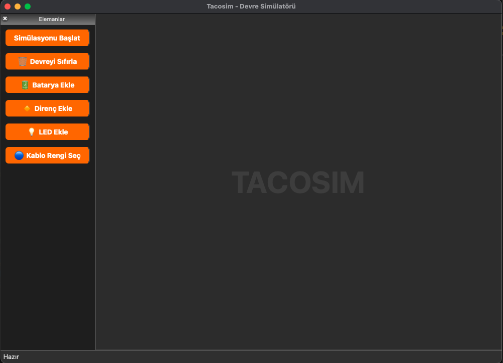

# 🔌 TACOSIM - Devre Simülatörü

**TACOSIM**, öğrencilerin temel elektronik bileşenleri kullanarak sürükle-bırak yöntemiyle devreler kurabildiği ve bu devreleri simüle edebildiği açık kaynaklı bir eğitim yazılımıdır.  
**Pardus uyumlu**, sade, modern ve genişletilebilir bir tasarıma sahiptir.

---

## 📷 Ekran Görüntüsü



---

## 🎯 Özellikler

| Özellik                   | Açıklama                                                                 |
|---------------------------|--------------------------------------------------------------------------|
| ⚙️ Sürükle-bırak         | LED, direnç, batarya gibi elemanları sahneye kolayca yerleştirin         |
| 🎨 Kablo Bağlama         | Pinden pine kablo çekerek devre oluşturma                                |
| 🖱️ Sağ Tık İptal        | Bağlantı sırasında sağ tıklayarak işlemi iptal edebilme                   |
| 🔄 Simülasyon            | Doğru bağlanan devrelerde LED yanar, ters bağlantı çalışmaz              |
| 🧠 Gerçekçi Mantık       | Akım yönü, direnç etkisi, zincir takip sistemi                           |
| 💾 JSON Kaydet/Yükle     | Devreyi `.json` dosyası olarak kaydedip tekrar yükleyebilme               |
| ⚡ Dinamik Simülasyon     | Simülasyon açıkken bile bağlantılar eklenebilir                          |
| 🖥️ Zoom / Pan           | Mouse ile zoom yapılabilir, orta tuş ile sahne gezdirilebilir             |
| 💧 Watermark             | Sahne ortasında fade TACOSIM yazısı                                      |
| 🧰 Temiz Arayüz          | Modern karanlık tema, sade simgeler, okunabilir yazılar                  |

---

## 🏁 Kurulum

> Geliştirme ortamı: `Python 3.10+`, `PyQt5`, `Pardus`, `macOS`

```bash
git clone https://github.com/yusufozcelik/tacosim.git
cd tacosim
python3 -m venv venv
source venv/bin/activate  # Windows: venv\Scripts\activate
pip install -r requirements.txt
python3 main.py
```

---

## 🧪 Kullanım

1. Sol panelden eleman ekleyin (LED, direnç, batarya)
2. Bir pini tıklayın, sonra diğer pini tıklayarak kablo çekin
3. Simülasyonu başlatmak için "Simülasyonu Başlat" butonuna basın
4. Devre doğruysa LED yanar. Ters bağlantı yapılırsa çalışmaz
5. Dosya > Devreyi Kaydet veya Yükle ile ilerleyin

---

## 🔋 Desteklenen Elemanlar

| Eleman    | Özellikler                      |
|-----------|---------------------------------|
| LED       | + ve - uç kontrolü, yanma simülasyonu |
| Batarya   | VCC ve GND ucu, güç kaynağı         |
| Direnç    | Değer ayarı (Ω, kΩ), simülasyon etkisi |
| Kablo     | Renk seçilebilir, pin bağlantılı     |

> Yakında: Buton, potansiyometre, ampermetre, voltmetre...

---

## 💻 Geliştirici Notları

- Her eleman için `to_dict()` / `from_dict()` metodları vardır
- `DynamicWire` kablolar da JSON ile kayıt edilir
- Bağlantılar `connected_pin` ile çift yönlü tutulur
- `MainWindow` içindeki `save_scene_to_json()` / `load_scene_from_json()` işlevseldir

---

## 🏫 Geliştirenler

> Bu yazılım, **TACETTİN ASLAN MTAL** öğrencileri tarafından  
> **TEKNOFEST** yarışması için geliştirilmektedir.

📅 Proje Başlangıç: 2025
🧪 Amaç: Eğitimde elektronik devre öğretimini sadeleştirmek

---
